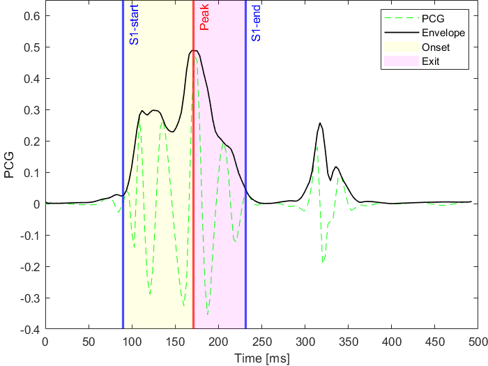
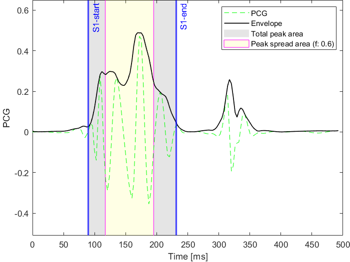
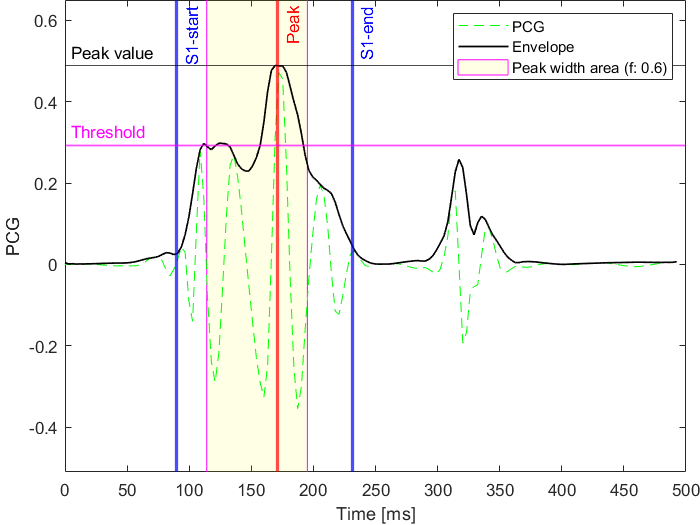
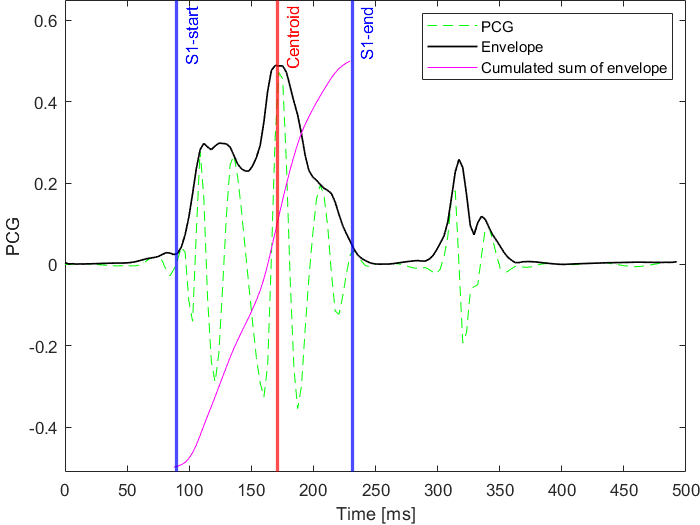

Features
========
Time domain features
--------------------
.. autofunction:: pyPCG.features.time_delta
.. autofunction:: pyPCG.features.zero_cross_rate
.. autofunction:: pyPCG.features.ramp_time

   Onset and exit times in an example S1 case

.. autofunction:: pyPCG.features.peak_spread

   Peak spread in an example S1 case

.. autofunction:: pyPCG.features.peak_width

   Peak width in an example S1 case

.. autofunction:: pyPCG.features.peak_centroid

   Peak centroid in an example S1 case

Frequency domain features
-------------------------
.. autofunction:: pyPCG.features.max_freq
.. autofunction:: pyPCG.features.spectral_spread
.. autofunction:: pyPCG.features.spectral_width
.. autofunction:: pyPCG.features.spectral_centroid
.. autofunction:: pyPCG.features.spectrum_raw

Wavelet based features
----------------------
.. autofunction:: pyPCG.features.max_cwt
.. autofunction:: pyPCG.features.cwt_peakdist
.. autofunction:: pyPCG.features.dwt_intensity
.. autofunction:: pyPCG.features.dwt_entropy

Complexity based features
-------------------------
.. autofunction:: pyPCG.features.katz_fd
.. autofunction:: pyPCG.features.lyapunov

Feature grouping
----------------
.. autotypeddict:: pyPCG.features.feature_config
.. autoclass:: pyPCG.features.feature_group
    :members: