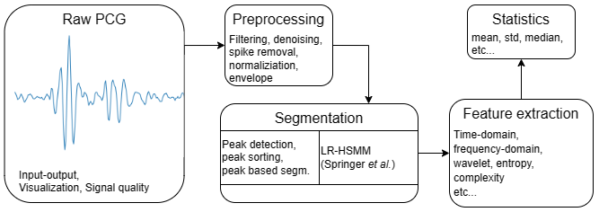

Welcome to pyPCG's documentation!
=================================
A signal processing toolbox for processing phonocardiography (PCG) data. Including support for multiple data formats, segmentation based on envelope peak detection, and Markov model based methods, feature extraction, and statistics calculation.

Current version: 0.1-alpha

Planned release: soon

Introduction
------------
pyPCG was created to standardize the multiple methods described in literature and to create a toolbox to streamline the use of common processing steps.

The main design was to create a framework which can be easily expanded and once a processing pipeline was created it can be reused without major modifications to the code.

We used type annotations in public functions to help development using this library.

Description
-----------
The modules implement the following steps:

* Signal I/O
* Separation of long signals to shorter ones
* Signal quality index calculation
* Denoising
* Filtering
* Envelope extraction
* Peak detection and sorting
* Segmentation
* Feature extraction
* Statistics calculation
* Visualization

   The basic flowchart of the pyPCG toolbox

.. toctree::
   usage
   io
   pyPCG
   sqi
   preprocessing
   segment
   lr_hsmm
   features
   stats
   :maxdepth: 2
   :caption: Contents:

.. include:: /tutorials
.. toctree:: 
   tutorials/quickstart
   tutorials/process_pipeline
   tutorials/segment
   tutorials/feature_group
   tutorials/stats_group
   :caption: Tutorials:

Correspondence
--------------
Kristóf Müller (Phd student) PPCU-ITK, Budapest, Hungary

muller.kristof@itk.ppke.hu